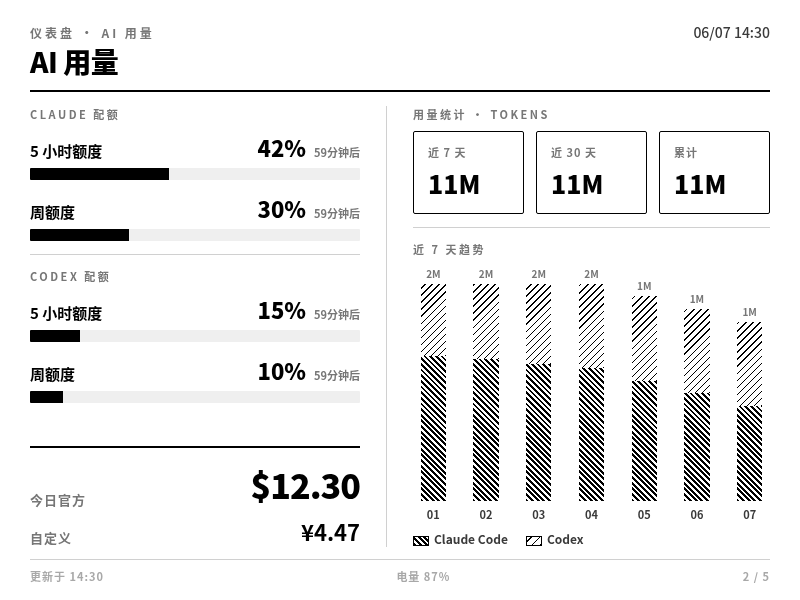
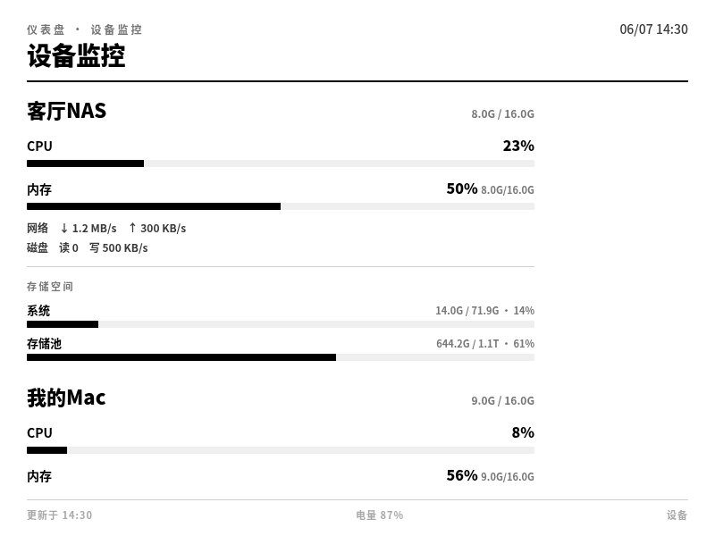
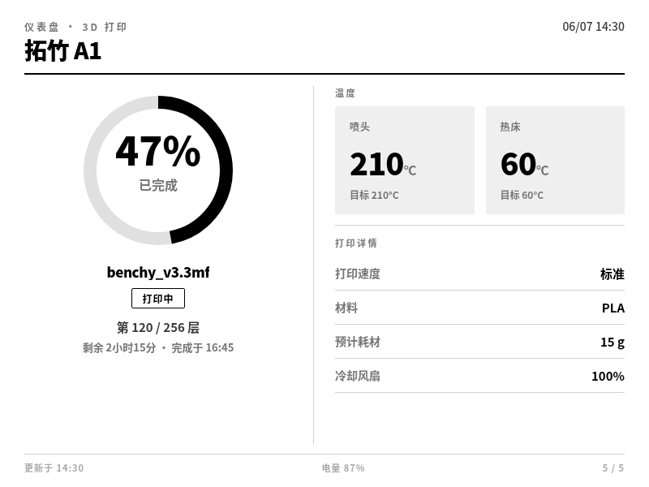
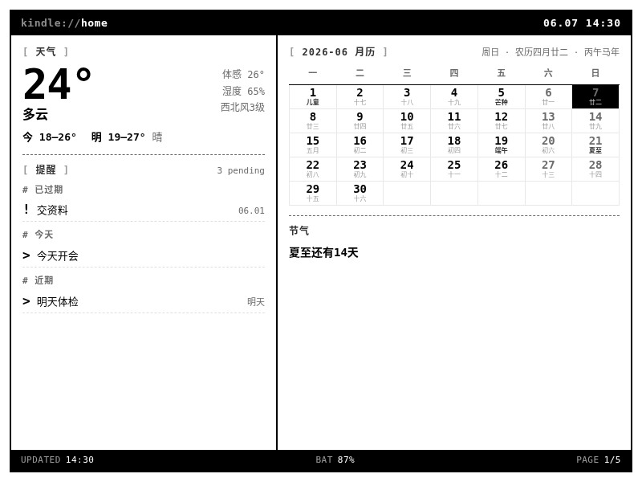
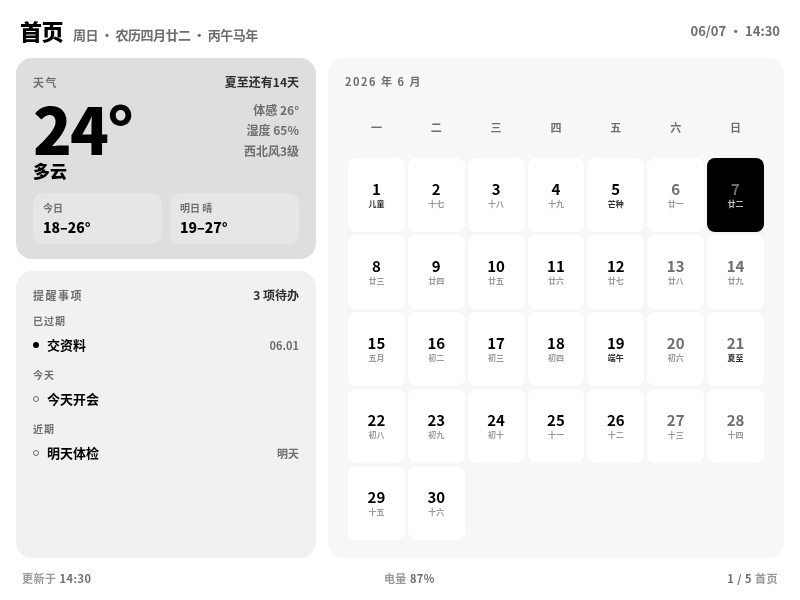

# Kindle Dashboard

> 把越狱的 Kindle 变成可配置的家庭信息看板 —— 两条命令 + 一个网页设置,不写代码。
> Turn a jailbroken Kindle into a configurable home info dashboard — two commands + one web page, no coding.

> 💡 **关于作者 / About the author**
> 本人**没有任何代码经验**,这个项目的**全部代码都由 AI(Claude Code）完成**,我只负责提需求、做系统设计和真机测试。如果你也不会写代码,照着下面的命令一步步来即可。
> I have **no coding experience whatsoever**. **Every line of code in this project was written by AI (Claude Code)** — I only provided the requirements, system design, and real-device testing. If you can't code either, just follow the commands below step by step.

**[中文](#中文) · [English](#english)**

---

<a name="中文"></a>

# 中文

⚠️ **越狱免责**:越狱有风险。本项目**不含**越狱工具,只负责越狱**之后**的部分。
🔒 **凭据安全**:你填的天气 Key / HA Token / SSH 账号**只存本地**(`config.yaml`),不上传任何服务器。

## 🚀 一键部署

三步,每步一条命令,中间一次网页点选,全程不写代码:

**① 装服务**(在一台常开的 Mac 上)

```bash
git clone <repo-url> kindle-dashboard && cd kindle-dashboard
bash installers/macos/install.sh
```

脚本自动:建虚拟环境、装依赖、从示例生成 `config.yaml`、装 launchd 开机自启、启动服务。装完打印你的**设置页链接**和 **Kindle 拉图地址**。中途只会问你两件事(是否自动下载渲染引擎、是否启用 AI 用量),回车默认即可。

**② 网页设置**(浏览器点选,所见即所得)

打开安装时打印的带令牌链接 `http://localhost:8585/setup?token=...`(或点 Mac 顶部菜单栏小图标 →「打开设置页」)。按模块填:天气、设备监控、Home Assistant、页面与风格、**界面语言(中/英)**——右侧**实时预览**。保存即生效,服务热重载,无需重启。（英文版看板自动隐藏农历/节气/生肖等中国元素;菜单栏也可切语言。）

**③ 配 Kindle**(USB 连上 Mac、已越狱并开了 USBNetwork/SSH)

```bash
sh installers/kindle/install.sh
```

脚本推送显示脚本 + 写服务地址 + 加开机自启 + 立即上屏。之后**改配置只在网页保存即可,Kindle 侧再也不用碰**。

> **不想用了?一键卸载,Kindle 完全恢复正常**:`sh installers/kindle/uninstall.sh` 会停看板、移除开机自启、删掉推送的脚本、恢复原界面——**Kindle 回到越狱前的正常状态,照常当电子书用,不留残留**。再加 `bash installers/macos/uninstall.sh` 停掉 Mac 服务即可。

## 这是什么

Kindle 当瘦客户端,只定时拉一张渲染好的 PNG 刷上屏;采集、聚合、渲染全在一台常开电脑(Mac/NAS)上完成。

```
各数据源 → 常开电脑上的服务(采集 + Chromium 渲染 PNG)→ Kindle 每 20s 拉图显示
```

- 天气、提醒事项、AI 用量、设备监控(Win/Linux/Mac)、智能家居实体墙、3D 打印机(后两者经 Home Assistant)
- **配置化**:所有 IP / 密钥 / 页面 / 风格从网页设置读,代码里不写死
- **配置即页面**:填了哪个数据源才显示对应页,没填自动隐藏
- **诚实降级**:缺数据显示占位,不报错、不白屏;一个数据源挂掉不影响其他源

## 效果预览

杂志风 `style_a`(默认皮肤)的几个页面(以下均为**演示数据**):

| <br>**首页** | <br>**AI 用量** |
|:---:|:---:|
| <br>**设备监控** | <br>**3D 打印机** |

同一张首页换不同内置皮肤(共 **7 套**):

| <br>`terminal` | <br>`newspaper` | <br>`bento` |
|:---:|:---:|:---:|

> 上图为横屏正立展示;实际刷到 Kindle 是旋转后的**竖屏灰度**图。

## 前置要求

- 一台**常开**的 Mac 或 NAS(NAS 用 Docker 部署,见下方)
- 已安装 **Chrome 或 Chromium** 用于渲染(没有也行:安装时可选自动下载内置 chromium,装进虚拟环境、不动系统)
- 一台**已越狱**且**已开启 SSH** 的 Kindle(本项目不含越狱工具;标准越狱流程装的 MRPI 已自带 fbink)
- 数据线用支持**数据传输**的(非纯充电线)

<details>
<summary><b>怎么在 Kindle 上开 SSH</b>(越狱后一次性操作,已开过的跳过)</summary>

越狱完成后,Kindle 上会多出一个 **KUAL** 应用(启动器)。打开它:

**USB SSH(推荐首次用,不依赖 WiFi)**:
1. KUAL → **USBNetwork** → **Toggle USBNetwork**(`usbnet` 状态变 `enabled`)
2. KUAL → USBNetwork → **Toggle SSH over USB only**(确认 `sshd for USB` 显示 `enabled`)
3. 用数据线把 Kindle 插到电脑,电脑上会多出一个 USB 网卡
4. 电脑终端:`ssh root@192.168.15.244`(密码 `mario`,越狱默认;改过用你自己的)
5. 装完看板后可以拔线,Kindle 通过 WiFi 拉图,不用一直插着

**WiFi SSH(方便远程调试,但需要先知道 Kindle IP)**:
1. 确保 Kindle 已连上和电脑同一个 WiFi
2. KUAL → USBNetwork → **Toggle SSH over WiFi**(确认 `sshd for WiFi` 显示 `enabled`)
3. 在 Kindle 上查 IP:首页 → 设置 → 设备信息 → 里面有 WiFi IP(如 `192.168.5.36`)
4. 电脑终端:`ssh root@192.168.5.36`(密码同上)

> 如果 KUAL 里没有 USBNetwork 菜单,说明越狱时漏装了 USBNetwork hack——去 MobileRead 论坛下载对应型号的 `kindle-usbnet-hack` 装上即可。
</details>

## 快速开始(Mac)

### 1. 装服务

见上「🚀 一键部署 ①」。手动起服务(调试用):`.venv/bin/python -m server.run`。

- 配置文件:**存在仓库外** `~/.config/kindle-dashboard/config.yaml`(`KINDLE_CONFIG` 可覆盖)——这样**升级 / 重装 / 删库重拉都不会丢你的设置**;老版本放在仓库内的会自动迁移过去
- 日志:`data/*.log`,服务自动轮转(超 5MB 截断留最近 1MB),长期跑不爆盘
- **访问令牌**:首次启动自动生成,存 `config.yaml` 的 `server.access_token`,防同 WiFi 他人窥探/篡改设置页。**用带令牌的链接打开设置页**;Kindle 拉图、设备上报、`/health` 豁免,不受影响
- **在线升级**:Mac 顶部菜单栏 →「检查更新」,有新版点「升级」自动 `git pull` + 重启(配置在仓库外,升级不丢设置)

### 2. 网页设置

见上「🚀 一键部署 ②」。按模块填:

- **天气**:和风天气 QWeather 的 Key + API Host + 城市(搜城市名直接选,自动匹配编码)
- **AI 用量**:本机直读 ccusage,安装时选「启用」即自动装好;可设 **Claude / Codex 价格倍率**(中转站对账,官方价 × 倍率)
- **设备监控**:加要监控的机器(本机直读 / 推 agent / SSH 拉),可重命名、勾选显示项
- **Home Assistant**:地址 + 长期访问令牌(填了才出打印机 / 智能家居页)
- **页面与风格**:选风格(7 套皮肤)、选 Kindle 机型(按原生分辨率出清晰图),右侧实时预览

### 3. 配 Kindle

见上「🚀 一键部署 ③」。完整命令(可带参数):

```bash
sh installers/kindle/detect.sh [KINDLE_IP]                 # 先确认能识别到 Kindle
sh installers/kindle/install.sh [KINDLE_IP] [SERVER_URL] [INTERVAL]
```

Kindle 开始显示看板(**横放**,顶边朝右)。安装时会问 **Kindle 拉图间隔**(默认 20s)。

> **SSH root 密码**:越狱包默认常为 `mario`,改过则用你设的(脚本会提示)。
> **Mac IP 会变?** 多半是 Apple「私有 Wi-Fi 地址」轮替导致——把当前 Wi-Fi 的该选项从「轮替」改成「固定」即可根治(详见 [docs/install.md](docs/install.md))。

## 不想用了(一键卸载,完全恢复)

随时可以一键退出,**Kindle 干净还原到正常状态**——继续当普通电子书用,不留任何脚本/自启残留(本项目只动看板相关部分,不碰你的越狱):

```bash
sh installers/kindle/uninstall.sh       # 还原 Kindle:停看板、移除开机自启、删除推送的脚本、恢复原界面
bash installers/macos/uninstall.sh      # 停 Mac 服务(加 --purge 连 venv/数据一起删,彻底清空)
```

> 🛟 **救命开关(防变砖,不需要 SSH/WiFi)**:万一看板占了屏、又连不上 Kindle(没开 USBNetwork、WiFi 也没连),
> 把 Kindle 用 USB 插任意电脑——它**默认就是 U 盘模式**,在盘根目录**新建一个空文件 `dashboard.off`**,
> 重启 Kindle 就回到正常界面(删掉该文件即恢复看板)。看板开机自启会先检查这个文件,有就不启动。

## NAS Docker 部署

不想 Mac 常开？把看板服务跑在 NAS 上(Docker),Mac 只负责推数据。

**NAS 上(一次)**

```bash
git clone <repo-url> kindle-dashboard && cd kindle-dashboard
bash installers/nas/install.sh
```

脚本自动构建镜像、启动容器、等健康检查通过,打印设置页链接和 Mac 侧命令。容器内打包了 Chromium + 中文字体 + 僵尸进程收割(tini),开箱即用。

配置和数据存在 Docker 卷(`config` / `data`)里,**重建容器不丢**。

**Mac 上(推数据到 NAS)**

**不需要在 Mac 上 clone 仓库。** 把 `NAS_IP` 换成你 NAS 的局域网地址(如 `192.168.5.138`),每条命令一行搞定:

```bash
# ① AI 用量(ccusage):采集本机 Claude/Codex 日志,定时推给 NAS
#    前提:先装 ccusage → npm install -g ccusage
curl -fsSL http://NAS_IP:8585/agent/install_ccusage.sh | sh -s -- http://NAS_IP:8585

# ② 提醒事项:读本机 Reminders.app,推给 NAS(仅 macOS)
curl -fsSL http://NAS_IP:8585/agent/install_reminders.sh | sh -s -- http://NAS_IP:8585

# ③ AI 额度(Claude/Codex 5h·周窗口,仅 macOS)
curl -fsSL http://NAS_IP:8585/agent/install_quota.sh | sh -s -- http://NAS_IP:8585
```

每条命令从 NAS 下载轻量脚本到 `~/.kindle-dashboard/`,装 launchd 定时推送,**Mac 重启后自动恢复**。不需要 Python、不需要 venv、不需要 config.yaml。

也可以直接打开 NAS 设置页,每个数据源卡片下面都有对应命令(NAS 地址已自动填好,复制粘贴即可)。

停用某项推送(把末尾参数换成 `uninstall`):
```bash
curl -fsSL http://NAS_IP:8585/agent/install_ccusage.sh | sh -s -- uninstall
curl -fsSL http://NAS_IP:8585/agent/install_reminders.sh | sh -s -- uninstall
curl -fsSL http://NAS_IP:8585/agent/install_quota.sh | sh -s -- uninstall
```

**多台 Mac / 多设备**:每台跑自己的 enable 命令即可,设备自动以主机名区分。看板服务按日期 + 模型把所有设备的数据**相加合并**(不是覆盖、不是取最大),AI 页显示的是所有设备的总量。

**怎么确认推送成功**:打开 NAS 设置页(浏览器),对应模块应该有数据出现;或者 `curl http://NAS_IP:8585/health` 看 `rendered` 里有没有对应页面。

**Kindle 上**

```bash
sh installers/kindle/install.sh KINDLE_IP http://NAS_IP:8585
```

把 Kindle 拉图地址指向 NAS 即可(第二个参数是看板服务地址)。

**管理**

```bash
cd installers/nas
docker compose logs -f           # 看日志
docker compose restart           # 重启(配置不丢)
docker compose down              # 停止
docker compose up -d --build     # 重建(代码更新后)
```

## 数据源一览

| 页面 | 数据源 | 需要 |
|---|---|---|
| 天气/首页 | 和风天气 QWeather | API Key + API Host + 城市 |
| 提醒事项 | 苹果提醒事项(含 iPhone iCloud 同步) | 一台 Mac 跑采集脚本推送 |
| 提醒事项 | Microsoft To Do | 微软账号登录一次(免密钥) |
| AI 用量 | ccusage(本机直读,无中间件) | 装了 ccusage 的机器(安装时自动装) |
| AI 额度 | Claude / Codex 5h·周窗口 | 仅 macOS,push 上报(见详细文档) |
| 设备监控 | Win/Linux/Mac | 本机直读 / 推 agent / SSH 拉 |
| 智能家居 | Home Assistant 实体 | HA 地址 + 令牌,网页选实体 |
| 3D 打印机 | 拓竹(经 Home Assistant) | HA 地址 + 令牌 |

详见 [docs/install.md](docs/install.md)(详细步骤 + 故障排查)、[数据契约](docs/data-contract.md)。

## 风格与分辨率

风格做成「数据契约 + 风格包」解耦:所有风格引用同一套[数据契约](docs/data-contract.md),网页下拉切换 + 实时预览。已内置 **7 套皮肤**(`style_a` 杂志风 + `terminal`/`bento`/`blueprint`/`minimal`/`newspaper`/`gauge`),每套覆盖全部页面。新增风格见 [docs/style-authoring.md](docs/style-authoring.md)。

**多分辨率**:设置页选 Kindle 机型即按原生分辨率出清晰图(基础版 6″/Paperwhite/Oasis/Scribe…);风格只按基准画布 800×600 设计,渲染时用 Chrome `--force-device-scale-factor` 矢量放大,字体线条依旧锐利、CSS 零改动。详见 [docs/multi-resolution-spec.md](docs/multi-resolution-spec.md)。

## 状态与路线

✅ **P0(Mac 版)核心闭环真机验证通过**(Mac 装服务 / 网页配置预览 / Kindle 一键上屏 / 一键还原,均在真机跑通)。
✅ **P1(NAS Docker)已实现** —— `docker compose up` 一键部署,Chromium / 中文字体 / 僵尸收割打进镜像;Mac 数据(ccusage / 提醒 / 额度)通过 push 脚本推到 NAS,多设备按日汇总相加。
🚧 部分 macOS/Windows 采集路径(push agent、SSH 拉)待更多真机验证。
全套自动化测试(`python3 -m pytest tests/ -q`)覆盖配置 schema/加载/校验、数据契约/整合、渲染管线真实出图、风格调度、Linux 采集端到端、主服务全部 API、设置页与实时预览、NAS 多设备合并。

路线:**P0 Mac ✅ → P1 NAS Docker ✅ → P2 风格系统 → P3 扩展**。

## License

本项目以 **MIT 许可证**开源,见 [LICENSE](LICENSE)。可自由使用、修改、商用,保留版权署名即可;软件按「原样」提供、不担保、作者不担责。

---

<a name="english"></a>

# English

⚠️ **Jailbreak disclaimer**: Jailbreaking carries risk. This project does **not** include jailbreak tools — it only handles what comes **after** the jailbreak.
🔒 **Credential safety**: Your weather key / HA token / SSH credentials are **stored locally only** (`config.yaml`) and never uploaded anywhere.

## 🚀 One-command deploy

Three steps, one command each, with one round of web-form clicking in between — no coding at all:

**① Install the service** (on an always-on Mac)

```bash
git clone <repo-url> kindle-dashboard && cd kindle-dashboard
bash installers/macos/install.sh
```

The script automatically: creates a virtualenv, installs dependencies, generates `config.yaml` from the example, installs a launchd autostart, and starts the service. When done it prints your **settings-page link** and **Kindle image URL**. It only asks you two things along the way (auto-download the render engine? enable AI usage?) — pressing Enter takes the defaults.

**② Configure via web** (point-and-click, WYSIWYG)

Open the token link printed at install time: `http://localhost:8585/setup?token=...` (or click the menu-bar icon at the top of your Mac → "Open settings"). Fill in by module: Weather, Device monitoring, Home Assistant, Pages & styles, **UI language (中/EN)** — with a **live preview** on the right. Saves take effect immediately via hot-reload, no restart. (The English dashboard auto-hides Chinese-calendar elements — lunar date, solar terms, zodiac; the menu bar can switch language too.)

**③ Set up the Kindle** (connected via USB, already jailbroken with USBNetwork/SSH enabled)

```bash
sh installers/kindle/install.sh
```

The script pushes the display scripts, writes the server address, adds autostart, and puts the dashboard on screen right away. After that, **just save config changes in the web page — you never touch the Kindle again.**

> **Done with it? One-command uninstall, Kindle fully back to normal**: `sh installers/kindle/uninstall.sh` stops the dashboard, removes autostart, deletes the pushed scripts, and restores the original UI — **the Kindle returns to its normal state and works as a regular e-reader again, with no leftovers**. Then `bash installers/macos/uninstall.sh` stops the Mac service.

## What is this

The Kindle acts as a thin client: it just periodically fetches one pre-rendered PNG and pushes it to the screen. Collection, aggregation, and rendering all happen on one always-on computer (Mac/NAS).

```
data sources → service on always-on computer (collect + Chromium render PNG) → Kindle fetches image every 20s
```

- Weather, reminders, AI usage, device monitoring (Win/Linux/Mac), a Home Assistant entity wall, and a 3D printer (the last two via Home Assistant)
- **Config-driven**: every IP / key / page / style is read from the web settings; nothing user-specific is hardcoded
- **Config = pages**: a page shows only if its data source is configured; unconfigured pages auto-hide
- **Honest degradation**: missing data shows a placeholder — never an error, never a blank screen; one failing source doesn't affect the others

## Screenshots

A few pages of the magazine-style `style_a` (default skin) — all rendered with **demo data**:

| <br>**Home** | <br>**AI usage** |
|:---:|:---:|
| <br>**Devices** | <br>**3D printer** |

The same Home page in different built-in skins (**7 total**):

| <br>`terminal` | <br>`newspaper` | <br>`bento` |
|:---:|:---:|:---:|

> Shown upright in landscape; on the actual Kindle it's a rotated **portrait grayscale** image.

## Requirements

- An **always-on** Mac or NAS (NAS uses Docker — see below)
- **Chrome or Chromium** for rendering (optional: the installer can auto-download a bundled chromium into the virtualenv without touching your system)
- A **jailbroken** Kindle with **SSH enabled** (this project does not include jailbreak tools; the standard jailbreak toolchain MRPI already ships fbink)
- A **data-capable** USB cable (not a charge-only cable)

<details>
<summary><b>How to enable SSH on the Kindle</b> (one-time setup after jailbreak; skip if already done)</summary>

After jailbreaking, the Kindle will have a **KUAL** app (launcher). Open it:

**USB SSH (recommended for first-time setup — no WiFi needed):**
1. KUAL → **USBNetwork** → **Toggle USBNetwork** (`usbnet` status changes to `enabled`)
2. KUAL → USBNetwork → **Toggle SSH over USB only** (confirm `sshd for USB` shows `enabled`)
3. Connect the Kindle to your computer with a data cable — a new USB network adapter appears
4. On your computer: `ssh root@192.168.15.244` (password `mario`, the jailbreak default; use yours if you changed it)
5. After setting up the dashboard you can unplug — the Kindle fetches images over WiFi, no permanent USB connection needed

**WiFi SSH (convenient for remote access, but you need to know the Kindle's IP first):**
1. Make sure the Kindle is on the same WiFi as your computer
2. KUAL → USBNetwork → **Toggle SSH over WiFi** (confirm `sshd for WiFi` shows `enabled`)
3. Find the Kindle's IP: Home → Settings → Device Info → look for the WiFi IP (e.g. `192.168.5.36`)
4. On your computer: `ssh root@192.168.5.36` (same password)

> If you don't see USBNetwork in KUAL, the jailbreak is missing the USBNetwork hack — download `kindle-usbnet-hack` for your model from the MobileRead forums and install it.
</details>

## Quick start (Mac)

### 1. Install the service

See "🚀 One-command deploy ①" above. To run manually (for debugging): `.venv/bin/python -m server.run`.

- Config file: **stored outside the repo** at `~/.config/kindle-dashboard/config.yaml` (override with `KINDLE_CONFIG`) — so **upgrades / reinstalls / delete-and-reclone never lose your settings**; an old in-repo `config.yaml` is auto-migrated
- Logs: `data/*.log`, auto-rotated by the service (truncated to the last 1MB past 5MB) so long runs won't fill the disk
- **Access token**: auto-generated on first start, stored in `server.access_token` of `config.yaml`, to keep others on the same WiFi from snooping/tampering with the settings page. **Open the settings page via the token link**; Kindle image fetch, device reporting, and `/health` are exempt.
- **Online upgrade**: Mac menu bar → "Check for updates"; if a new version exists, click "Upgrade" to auto `git pull` + restart (config lives outside the repo, so upgrades never touch your settings).

### 2. Configure via web

See "🚀 One-command deploy ②" above. Fill in by module:

- **Weather**: QWeather API Key + API Host + city (search by city name and pick — the code is matched automatically)
- **AI usage**: reads local ccusage directly; choose "enable" at install time and it's set up automatically. You can set **Claude / Codex price multipliers** (for reconciling with a relay provider — official price × multiplier)
- **Device monitoring**: add machines to monitor (local read / push agent / SSH pull), rename them, pick which metrics to show
- **Home Assistant**: address + long-lived access token (required for the printer / smart-home pages to appear)
- **Pages & styles**: choose a style (7 skins), choose your Kindle model (renders at native resolution), live preview on the right

### 3. Set up the Kindle

See "🚀 One-command deploy ③" above. Full commands (args optional):

```bash
sh installers/kindle/detect.sh [KINDLE_IP]                 # first confirm the Kindle is detected
sh installers/kindle/install.sh [KINDLE_IP] [SERVER_URL] [INTERVAL]
```

The Kindle starts showing the dashboard (**landscape**, top edge to the right). The installer asks for the **Kindle fetch interval** (default 20s).

> **SSH root password**: jailbreak packages often default to `mario`; use yours if you changed it (the script reminds you).
> **Mac IP keeps changing?** Usually Apple's "Private Wi-Fi Address" rotation — switch that option from "Rotating" to "Fixed" for the current network to fix it permanently (see [docs/install.md](docs/install.md)).

## Uninstall (one command, fully restored)

You can back out anytime — the **Kindle is cleanly restored to its normal state** and works as a regular e-reader again, with no leftover scripts or autostart entries (this project only touches dashboard-related parts, never your jailbreak):

```bash
sh installers/kindle/uninstall.sh       # restore Kindle: stop dashboard, remove autostart, delete pushed scripts, restore UI
bash installers/macos/uninstall.sh      # stop the Mac service (add --purge to also delete venv/data for a full wipe)
```

## NAS Docker deploy

Don't want to keep a Mac running 24/7? Run the dashboard service on a NAS (Docker) — the Mac only pushes data.

**On the NAS (once)**

```bash
git clone <repo-url> kindle-dashboard && cd kindle-dashboard
bash installers/nas/install.sh
```

The script builds the image, starts the container, waits for the health check, and prints the settings-page link plus Mac-side commands. The container ships with Chromium + CJK fonts + zombie reaping (tini), ready out of the box.

Config and data live in Docker volumes (`config` / `data`) — **rebuilding the container never loses them**.

**On the Mac (push data to the NAS)**

**No need to clone the repo on the Mac.** Replace `NAS_IP` with your NAS's LAN address (e.g. `192.168.5.138`); each command is one line:

```bash
# ① AI usage (ccusage): collect local Claude/Codex logs, push to NAS
#    Prerequisite: install ccusage first → npm install -g ccusage
curl -fsSL http://NAS_IP:8585/agent/install_ccusage.sh | sh -s -- http://NAS_IP:8585

# ② Reminders: read local Reminders.app, push to NAS (macOS only)
curl -fsSL http://NAS_IP:8585/agent/install_reminders.sh | sh -s -- http://NAS_IP:8585

# ③ AI quota (Claude/Codex 5h·weekly windows, macOS only)
curl -fsSL http://NAS_IP:8585/agent/install_quota.sh | sh -s -- http://NAS_IP:8585
```

Each command downloads a lightweight script from the NAS into `~/.kindle-dashboard/` and sets up a launchd timer — **survives Mac reboot automatically**. No Python venv, no config.yaml, no repo clone.

You can also open the NAS settings page — each data-source card shows the corresponding command with the NAS address pre-filled (just copy and paste).

To disable a specific push (replace the trailing argument with `uninstall`):
```bash
curl -fsSL http://NAS_IP:8585/agent/install_ccusage.sh | sh -s -- uninstall
curl -fsSL http://NAS_IP:8585/agent/install_reminders.sh | sh -s -- uninstall
curl -fsSL http://NAS_IP:8585/agent/install_quota.sh | sh -s -- uninstall
```

**Multiple Macs / devices**: just run the enable commands on each machine — devices are auto-identified by hostname. The dashboard service **sums all devices' data by date + model** (no overwriting, no max) so the AI page shows the combined total across all machines.

**How to confirm pushes are working**: open the NAS settings page in a browser — the corresponding module should show data; or run `curl http://NAS_IP:8585/health` and check if the `rendered` array includes the relevant pages.

**On the Kindle**

```bash
sh installers/kindle/install.sh KINDLE_IP http://NAS_IP:8585
```

Point the Kindle's image URL at the NAS (the second argument is the dashboard service address).

**Management**

```bash
cd installers/nas
docker compose logs -f           # view logs
docker compose restart           # restart (config preserved)
docker compose down              # stop
docker compose up -d --build     # rebuild (after code updates)
```

## Data sources

| Page | Source | Needs |
|---|---|---|
| Weather / Home | QWeather | API Key + API Host + city |
| Reminders | Apple Reminders (incl. iPhone via iCloud) | a Mac running the sync script |
| Reminders | Microsoft To Do | one Microsoft sign-in (no API key) |
| AI usage | ccusage (local read, no middleware) | a machine with ccusage (auto-installed) |
| AI quota | Claude / Codex 5h·weekly windows | macOS only, pushed in (see docs) |
| Device monitoring | Win/Linux/Mac | local read / push agent / SSH pull |
| Smart home | Home Assistant entities | HA address + token, pick entities in web |
| 3D printer | Bambu Lab (via Home Assistant) | HA address + token |

See [docs/install.md](docs/install.md) (detailed steps + troubleshooting), [data contract](docs/data-contract.md).

## Styles & resolutions

Styles are decoupled as "data contract + style pack": all styles reference the same [data contract](docs/data-contract.md), switchable from a web dropdown with live preview. **7 skins** are built in (`style_a` magazine-style + `terminal`/`bento`/`blueprint`/`minimal`/`newspaper`/`gauge`), each covering every page. To author a new style, see [docs/style-authoring.md](docs/style-authoring.md).

**Multi-resolution**: pick your Kindle model in settings and it renders at native resolution (basic 6″ / Paperwhite / Oasis / Scribe…). Styles are designed against an 800×600 base canvas and vector-scaled at render time via Chrome's `--force-device-scale-factor` — fonts and lines stay sharp, with zero CSS changes. See [docs/multi-resolution-spec.md](docs/multi-resolution-spec.md).

## Status & roadmap

✅ **P0 (Mac) core loop verified on real hardware** (Mac service install / web config & preview / one-command Kindle display / one-command rollback all run on real devices).
✅ **P1 (NAS Docker) implemented** — `docker compose up` one-command deploy with Chromium / CJK fonts / zombie reaping baked into the image; Mac data (ccusage / reminders / quota) pushed to NAS via scripts, multi-device daily totals summed automatically.
🚧 Some macOS/Windows collection paths (push agent, SSH pull) await more real-device verification.
The full automated test suite (`python3 -m pytest tests/ -q`) covers config schema/loading/validation, the data contract/integration, real render-pipeline output, style scheduling, end-to-end Linux collection, all main-service APIs, the settings page with live preview, and NAS multi-device merge.

Roadmap: **P0 Mac ✅ → P1 NAS Docker ✅ → P2 style system → P3 extensions**.

## License

Open-sourced under the **MIT License**, see [LICENSE](LICENSE). Free to use, modify, and use commercially as long as the copyright notice is retained; the software is provided "as is", without warranty, and the author bears no liability.
